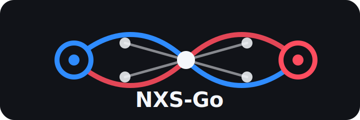

<p align="center">
  
</p>

# NXS-Go

NXS-Go is a local-first abstract strategy game about connection, pressure, and isolation.

Two players build living networks from their Sources. They route pressure through edges, capture weak points, and try to trigger isolation. A branch that loses connection to its Source goes dark.

Current status: **v0.2 AI Arena experiments**.

## v0.1 Scope

The first playable prototype focuses on the core loop:

1. **SYNCH**: place a node near your living network.
2. **ROUTE**: direct flow along an edge.
3. **PULSE**: resolve route pressure and capture overloaded opponent nodes.
4. **Isolation check**: disconnected branches go dark.

Advanced asymmetry such as Signal Amplify and Noise Ghost Node is intentionally deferred until the base loop is stable.

## Quick Start

Install dependencies:

```powershell
python -m pip install -r requirements.txt
```

Start the prototype:

```powershell
python nxs_go.py
```

## Controls

- `H`: open/close in-game help
- `E`: open/close event history
- `U`: undo last completed action
- `S`: save session history to `history/`
- `1`: select SYNCH
- `2`: select ROUTE
- `3`: select PULSE
- `Space`: execute PULSE
- `R`: reset
- `Esc`: quit

Use the mouse to place nodes or select edges.

## First Play

1. Start the game. The help panel opens automatically.
2. Press `H` to close the help after reading it.
3. Signal starts on the blue Source ring.
4. Press `1` for SYNCH, then click near the blue Source to place a connected node.
5. Noise takes the next turn. Repeat near the red Source.
6. Press `2` for ROUTE, then click an edge touching one of your nodes to create an arrow.
7. Press `Space` to PULSE when you want to resolve pressure.

If a branch loses connection to its Source, it goes dark.

Press `S` any time to save the session history as a Markdown file. The saved history is useful for reviewing how a move created pressure, capture, or isolation.

For a more detailed guide, see `docs/PLAYBOOK.md`.

## Winning Pattern

The basic pattern is:

```text
Build from Source -> route pressure into weak nodes -> capture bridges -> trigger blackout
```

The game does not use points yet. For v0.1-A, advantage is shown as network structure:

- live nodes
- routed edges
- whether the Source is still connected

You win by keeping your Source alive while making the opponent's Source/network go dark.

If neither Source is isolated after 60 completed turns, Horizon Scoring awards the game to the structurally stronger living network.

## Test

Run the core logic tests:

```powershell
python -m unittest discover -s tests
```

## AI Arena

NXS-Go includes an early agent-facing environment in `nxs_go_ai.py`.

It exposes legal actions, observations, rewards, and baseline bots so the game can be tested by simple agents before future self-play work.

See `docs/AI_ARENA.md`.

Run a small baseline benchmark:

```powershell
python scripts\benchmark_agents.py --games 5 --max-turns 30
```

The current AI hypothesis is whether bridge-aware defense can contest greedy isolation pressure.

Turn-limit benchmark games include structural score leaders so experiments still produce evidence when no Source is isolated.

Current follow-up: `CounterRouteAgent` tests whether active defensive routing can contest greedy isolation better than passive bridge holding.

Latest hypothesis: `TargetedCounterPressureAgent` tests whether defense improves by routing into opponent pressure sources.

## Project Docs

- `ROADMAP.md`: milestone direction from v0.1-A to v1.0
- `CONTRIBUTING.md`: contribution guide and design rule
- `SECURITY.md`: local-first security and privacy policy
- `docs/ARCHITECTURE.md`: current code structure and rule boundary
- `docs/AI_ARENA.md`: agent interface and baseline bot direction
- `docs/AI_BENCHMARKS.md`: early baseline-agent results
- `docs/PLAYBOOK.md`: first-game guidance and winning pattern
- `LICENSE`: MIT license

## Current Design Rule

Connection is life.

Isolation is defeat.

## Next Milestone

Playtest **v0.1-A** before adding asymmetric abilities.

Answer these questions first:

- Does SYNCH feel clear?
- Does ROUTE feel like intention?
- Does PULSE explain why nodes change owner?
- Does isolation feel immediate and meaningful?
- Can both players understand why a branch went dark?

Only after those answers are clear should v0.1-B add:

- Signal Amplify
- Noise Ghost Node
- stronger visual feedback
